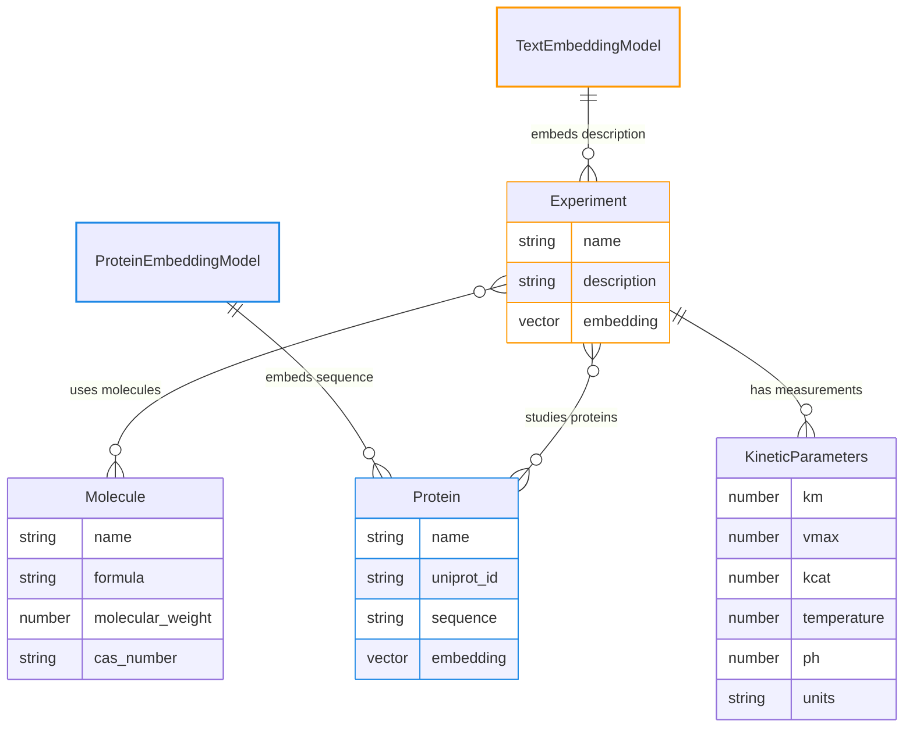

import { Steps, Tabs, TabItem } from '@astrojs/starlight/components';

MD-Models can attach **per-table embedding models** to your SQL tables and store the resulting vectors in PostgreSQL via the `pgvector` extension. Instead of a single global embedding backend, you configure which column of each table should be embedded and which model to use.

Once enabled, you get similarity search across multiple surfaces:

- **SQLModel tables** gain an `embedding` column for each configured table.
- **REST API** exposes `/vectorsearch` endpoints per table (see [FastAPI integration](/integrations/fastapi)).
- **GraphQL API** adds an optional `semantic_query` argument (see [GraphQL integration](/integrations/graphql)).
- **MCP server** surfaces similarity search tools that use embeddings (see [FastMCP integration](/integrations/fastmcp)).

This design is modular, because each table can use the embedding model that best matches its data (e.g., text vs. protein sequences), and all integrations reuse the same configuration.

## Attaching embeddings per table

Your markdown models stay purely schema-focused, and embeddings are configured only via `table_config` on the `DatabaseConnector`, where you choose for each table:

- which column to embed, and
- which embedding model to use.

This means you can wire up different embedding backends for each table without changing your markdown.

## Enable `pgvector`-backed storage

<Steps>

1. **Load your data model**

   ```python
   from mdmodels import DataModel

   library = DataModel.from_markdown("model.md")
   ```

2. **Configure per-table embedding models**

   Use any backend from `mdmodels.sql.vector` or your own implementation. In this example we use a text embedding model for `Experiment.description` and a protein embedding model for `Protein.sequence`:

   ```python
   from openai import OpenAI
   from esm_embedding import ESMCEmbedding
   from mdmodels.sql.vector import OpenAITextEmbedding

   esm_embedding = ESMCEmbedding.from_pretrained("esmc_300m")
   openai_embedding = OpenAITextEmbedding(
       client=OpenAI(),  # uses OPENAI_API_KEY / OPENAI_BASE_URL
       model="text-embedding-3-small",
   )
   ```

3. **Create a pgvector connector with `table_config`**

   ```python
   from mdmodels.sql import DatabaseConnector, DatabaseType

   db = DatabaseConnector(
       library=library,
       host="localhost",
       port=5432,
       username="postgres",
       password="postgres",
       database="postgres",
       db_type=DatabaseType.PGVECTOR,  # enables pgvector + extension install
       table_config={
           "Experiment": {
               "column": "description",
               "embedding_model": openai_embedding,
               "index": True,
           },
           "Protein": {
               "column": "sequence",
               "embedding_model": esm_embedding,
               "index": True,
           },
       },
   )
   ```

   Each entry in `table_config`:

   - **column**: the attribute name in your markdown model to embed
   - **embedding_model**: the backend that turns that column into a vector
   - **index**: whether to create a pgvector index to speed up similarity search

4. **Create tables**

   ```python
   # Creates tables with an `embedding` column for each configured table
   # Returns the generated SQLModel classes
   models = db.create_tables()
   ```

</Steps>

## Usage example: Biochemical experiments

First, the schema from `model.md`: `Experiment` records carry a `name` and `description` and relate to many `Molecule` entries (used molecules), many `Protein` entries (studied proteins), and many `KineticParameters` measurements. `Protein` has identifiers (`name`, `uniprot_id`), a `sequence`, and other fields. `Molecule` holds chemical metadata (name, formula, weight, CAS). `KineticParameters` stores kinetic measurements (km, vmax, kcat, temperature, pH, units).

Then, the embedders: we attach an OpenAI text embedder to the `description` field of `Experiment`, so every experiment row gets a text-derived vector in its `embedding` column. Separately, we attach an ESM-C protein embedder to the `sequence` field of `Protein`, so each protein row gets a sequence-derived vector in its `embedding` column. These per-table embeddings are what the vector searches use.



### Querying with different embedders

These two examples map directly to the schema above: experiments carry text `description` fields, and they relate to proteins that carry `sequence` fields. Each field has its own embedder, so the query payload determines which embedding space is used.

- OpenAI (text) embedding on `Experiment.description` (similarity in text space):

  <Tabs>
    <TabItem label="cURL (REST)">
      ```bash
      API_BASE="http://localhost:8000"
      QUERY="kinase kinetics"

      curl -s -X POST "$API_BASE/experiment/vectorsearch" \
        -H "Content-Type: application/json" \
        -d "{\"query\":\"$QUERY\",\"limit\":5}"
      ```
    </TabItem>
    <TabItem label="GraphQL">
      ```graphql
      {
        experiments(semantic_query: "kinase kinetics", limit: 5) {
          id
          name
          description
        }
      }
      ```
    </TabItem>
  </Tabs>

  Sends the text in the request; MD-Models embeds it with the OpenAI text model and matches against the `description` embeddings of experiments.

- ESM-C (protein) embedding via `Experiment` → `Protein.sequence` (similarity in protein sequence space):

  <Tabs>
    <TabItem label="cURL (REST)">
      ```bash
      API_BASE="http://localhost:8000"
      SEQUENCE="MENFQKVEKIGEGTYGVVYKARNKLTGEVVALKKIRLEFDTDVLKVL..."

      curl -s -X POST "$API_BASE/experiment/vectorsearch" \
        -H "Content-Type: application/json" \
        -d "{\"query\":\"$SEQUENCE\",\"table\":\"Protein\",\"limit\":5}"
      ```
    </TabItem>
    <TabItem label="GraphQL">
      ```graphql
      {
        experiments(
          semantic_query: "MENFQKVEKIGEGTYGVVYKARNKLTGEVVALKKIRLEFDTDVLKVL..."
          embedding_table: "Protein"
          limit: 5
        ) {
          id
          name
          proteins { name sequence }
        }
      }
      ```
    </TabItem>
  </Tabs>

  Includes `table`/`embedding_table` to force the protein embedder (ESM-C) on `Protein.sequence`, then returns experiments linked to the most similar proteins.

You can extend this pattern to any table: add an embedding model for another field (e.g., a small-molecule encoder on `Molecule` properties), and the same REST/GraphQL shapes will reuse that per-table embedder without changing client code.
