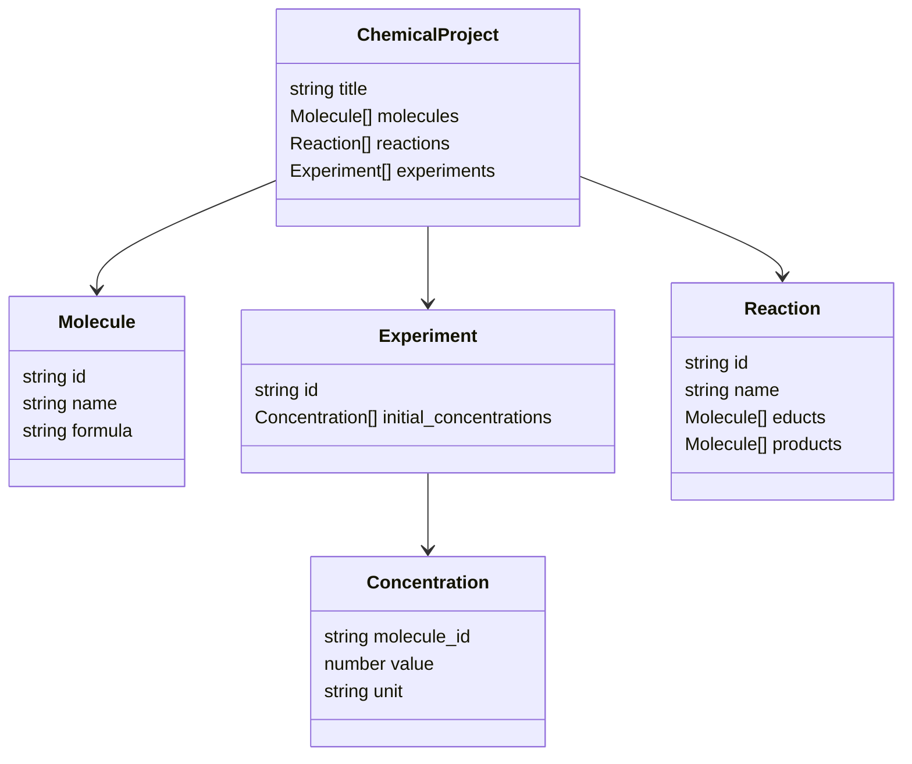

# Basic Example

---

### ChemicalProject

This object represents a chemical project and serves as the top-level container for managing various aspects of a
research project. It organizes the project's title, associated molecules, reactions, and experiments, providing a
structured overview of the entire chemical workflow.

- title
  - Type: string
  - Description: The name/title of the project.
  - PK: true
- molecules
  - Type: [Molecule](#molecule)[]
  - Description: The molecules used in the project.
- reactions
  - Type: [Reaction](#reaction)[]
  - Description: The reactions in the project.
- experiments
  - Type: [Experiment](#experiment)[]
  - Description: The experiments in the project.

---

### Molecule

- id
  - Type: string
  - Description: The identifier of the molecule.
- name
  - Type: string
  - Description: The name of the molecule.
  - Default: Lel
- formula
  - Type: string
  - Description: The formula of the molecule.

---

### Experiment

- id
  - Type: string
  - Description: The identifier of the experiment.
- initial_concentrations
  - Type: [Concentration](#concentration)[]
  - Description: The initial concentrations of the molecules in the experiment.

---

### Concentration

- molecule_id
  - Type: string
  - Description: The identifier of the molecule.
  - References: ChemicalProject.molecules.id
- value
  - Type: number
  - Description: The concentration of the molecule.
- unit
  - Type: string
  - Description: The unit of the concentration.

---

### Reaction

- id
  - Type: string
  - Description: The identifier of the reaction.
- name
  - Type: string
  - Description: The name of the reaction.
- educts
  - Type: [Molecule](#molecule)[]
  - Description: The reactants of the reaction.
- products
  - Type: [Molecule](#molecule)[]
  - Description: The products of the reaction.

---

### Element

- molecule_id
  - Type: string
  - Description: The identifier of the molecule.
- stoichiometry
  - Type: number
  - Description: The stoichiometry of the reactant.
