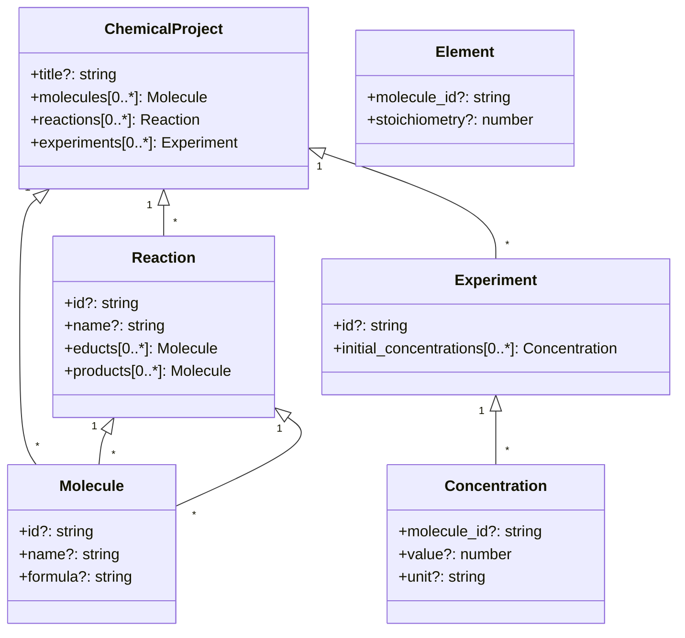

```mermaid
classDiagram
    %% Class definitions with attributes
    class ChemicalProject {
        +title?: string
        +molecules[0..*]: Molecule
        +reactions[0..*]: Reaction
        +experiments[0..*]: Experiment
    }

    class Molecule {
        +id?: string
        +name?: string
        +formula?: string
    }

    class Experiment {
        +id?: string
        +initial_concentrations[0..*]: Concentration
    }

    class Concentration {
        +molecule_id?: string
        +value?: number
        +unit?: string
    }

    class Reaction {
        +id?: string
        +name?: string
        +educts[0..*]: Molecule
        +products[0..*]: Molecule
    }

    class Element {
        +molecule_id?: string
        +stoichiometry?: number
    }

    %% Enum definitions
    %% Relationships
    ChemicalProject "1" <|-- "*" Molecule
    ChemicalProject "1" <|-- "*" Reaction
    ChemicalProject "1" <|-- "*" Experiment
    Experiment "1" <|-- "*" Concentration
    Reaction "1" <|-- "*" Molecule
    Reaction "1" <|-- "*" Molecule
```